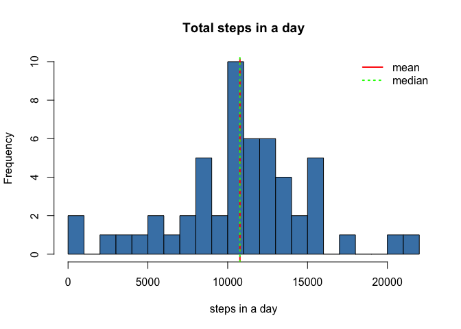
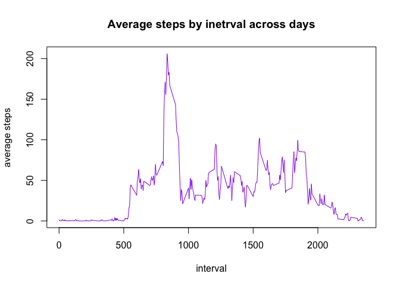
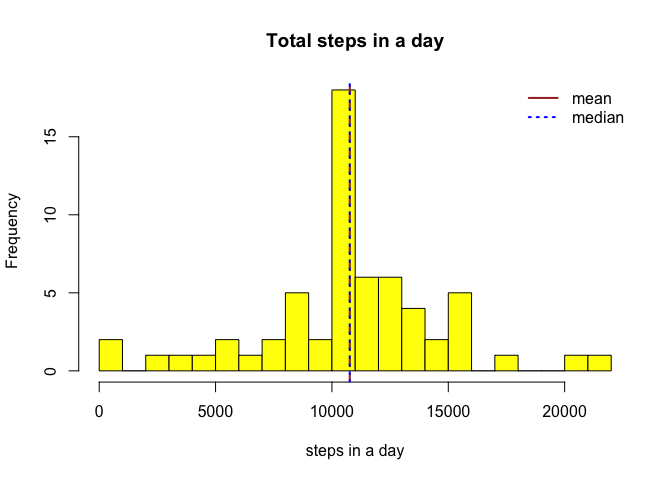
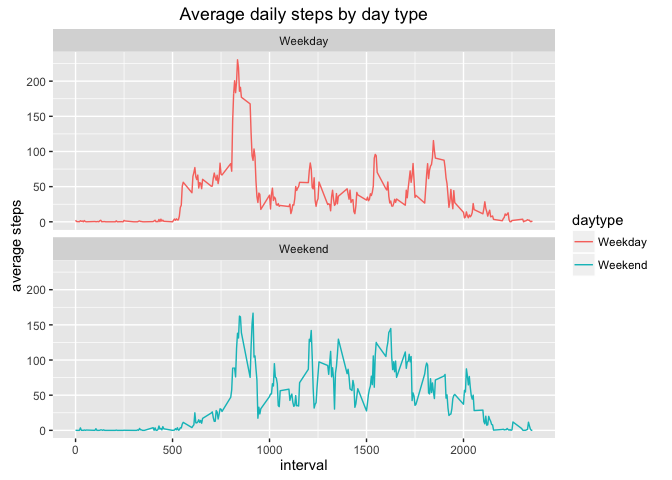

# Reproducible Research: Peer Assessment 1
Bala Sundarasamy

## Loading and preprocessing the data
The data is available in a zip file `activity.zip` in the current directory and it needs to be unzipped
 to produce the `csv` file.

```r
#Check activity.csv and unzip activity.zip
if(!file.exists("activity.csv")) {
    unzip("activity.zip")
}
```
Load the required libraries for this analysis

```r
library(lubridate, quietly = TRUE)
library(dplyr, quietly = TRUE)
library(ggplot2, quietly = TRUE)
```
Read the data file and check the data

```r
actData <- read.csv("activity.csv")
str(actData)
```

```
## 'data.frame':	17568 obs. of  3 variables:
##  $ steps   : int  NA NA NA NA NA NA NA NA NA NA ...
##  $ date    : Factor w/ 61 levels "2012-10-01","2012-10-02",..: 1 1 1 1 1 1 1 1 1 1 ...
##  $ interval: int  0 5 10 15 20 25 30 35 40 45 ...
```
###Fields
- steps - number of steps in the 5 minute interval

- date - date

- interval - 5 minute interval (0, 5, 10, 15...) for the whole day

Change the date to POSIXct class

```r
actData$date <- ymd(actData$date)
```

## What is mean total number of steps taken per day?

1. Calculate total steps taken per day ignoring the NA values. 

```r
total_steps_per_day <- group_by(actData, date) %>%
                        filter(!is.na(steps)) %>%
                        summarise(total_steps = sum(steps, na.rm=TRUE))
```

2. Make a histogram of total steps per day

```r
hist(total_steps_per_day$total_steps, col="steelblue",
                        xlab="steps in a day", main="Total steps in a day", breaks=20)
abline(v=mean(total_steps_per_day$total_steps), lty=2, lwd=2, col="red")
abline(v=median(total_steps_per_day$total_steps), lty=3, lwd=2, col="green")
legend("topright", legend = c("mean", "median"),
                  lty=c(1,3), lwd=c(2,2), col=c("red", "green"), bty="n")
```

<!-- -->

3. Calculate the mean & median of total steps per day 

Mean of total steps per day

```r
mean_of_total_steps <- mean(total_steps_per_day$total_steps)
mean_of_total_steps
```

```
## [1] 10766.19
```
Median of total steps per day

```r
median_of_total_steps <- median(total_steps_per_day$total_steps)
median_of_total_steps
```

```
## [1] 10765
```

## What is the average daily activity pattern?
1. Make a time series plot (i.e. 𝚝𝚢𝚙𝚎 = "𝚕") of the 5-minute interval (x-axis) and the average number of steps taken, averaged across all days (y-axis)


```r
#Average steps grouped by interval
average_steps_by_interval <- group_by(actData, interval) %>%
                                filter(!is.na(steps)) %>%
                                summarise(average_steps = mean(steps, na.rm=TRUE))

plot(average_steps_by_interval$interval, average_steps_by_interval$average_steps,
     type="l", col="purple2", xlab="interval", ylab="average steps",
     main="Average steps by inetrval across days")
```

<!-- -->

2. Which 5-minute interval, on average across all the days in the dataset, contains the maximum number of steps?


```r
average_steps_by_interval[which.max(average_steps_by_interval$average_steps), ]
```

```
## Source: local data frame [1 x 2]
## 
##   interval average_steps
##      (int)         (dbl)
## 1      835      206.1698
```

*Interval - 835 contains maximum steps across all days.*

## Imputing missing values

1. Calculate and report the total number of missing values in the dataset (i.e. the total number of rows with 𝙽𝙰s)


```r
sum(is.na(actData$steps))
```

```
## [1] 2304
```

2. Strategy for imputing missing steps is to find average over that interval across all days

3. We are going to create a new dataset by name `actData_narm`

```r
actData_narm <- actData
tbl_average_steps_by_interval <- tapply(actData_narm$steps, actData_narm$interval, mean,
                                  na.rm=TRUE, simplify = TRUE)
navector <- is.na(actData_narm$steps)
actData_narm$steps[navector] <- tbl_average_steps_by_interval[as.character(actData_narm$interval[navector])]
##Print NA count after impute
sum(is.na(actData_narm$steps))
```

```
## [1] 0
```

4.Histogram of new total steps per day with new mean and median lines

```r
#new total steps per day after imputing
new_total_steps_per_day <- group_by(actData_narm, date) %>%
                    summarise(new_total_steps=sum(steps, na.rm=TRUE))

hist(new_total_steps_per_day$new_total_steps, col="yellow",
     xlab="steps in a day", main="Total steps in a day", breaks=20)
abline(v=mean(new_total_steps_per_day$new_total_steps), lty=2, lwd=2, col="brown")
abline(v=median(new_total_steps_per_day$new_total_steps), lty=3, lwd=2, col="blue")
legend("topright", legend = c("mean", "median"),
       lty=c(1,3), lwd=c(2,2), col=c("brown", "blue"), bty="n")
```

<!-- -->

New mean

```r
new_mean_of_total_steps <- mean(new_total_steps_per_day$new_total_steps)
new_mean_of_total_steps
```

```
## [1] 10766.19
```

New Median

```r
new_median_of_total_steps <- median(new_total_steps_per_day$new_total_steps)
new_median_of_total_steps
```

```
## [1] 10766.19
```

*No deviation from the mean earlier and now median is equal to mean. But not much of deviation.*

## Are there differences in activity patterns between weekdays and weekends?

1. Create a new factor variable in the dataset with two levels – “weekday” and “weekend” indicating whether a given date is a weekday or weekend day

*The variable used here is `daytype` not `weektype` as suggested in the assignment*

```r
actData_narm <- mutate(actData_narm, 
            daytype= ifelse(weekdays(actData_narm$date)%in%c("Saturday", "Sunday"),
                            "Weekend", "Weekday"))

#How many measurements fall in weekday and weekend
table(actData_narm$daytype)
```

```
## 
## Weekday Weekend 
##   12960    4608
```

2. Make a panel plot for total steps across interval for all days in weekdays and weekends

```r
average_steps_by_daytype_n_interval <- group_by(actData_narm, daytype, interval) %>%
                                    summarise(average_steps=mean(steps, na.rm=TRUE))

g <- ggplot(average_steps_by_daytype_n_interval, aes(x=interval, y=average_steps, color=daytype)) +
        geom_line() +
        labs(title="Average daily steps by day type", x="interval", y="average steps") +
        facet_wrap(~daytype, ncol=1)
print(g)
```

<!-- -->

**End of analysis**
